## Table of Contents
- [Manual Testing](#manual-testing) 
* [Responsiveness](#responsiveness)
* [Overall Functional Testing](#overall-functional-testing)
    + [Navigation And Homepage](#navigation-and-homepage)
    + [Buttons](#buttons)
    + [Links](#links)
* [Workshops and Candle Products](#workshop-and-candle-products)
* [Registration and User Accounts(#registration-and-user-accounts)
* [Searching](#searching)
* [Basket and Checkout](#basket-and-checkout)
* [Admin Product Management](#admin-product-management)
- [Automated Testing](#automated-testing)
* [Validation Tests](#validation-tests)
* [Bugs](#bugs)

## Manual Testing
### Responsiveness
* Chrome Developer Tools was used to test responsiveness on all screen sizes.
* Physical testing was carried out on Desktop, iPad and various mobile devices.
* The deployed site was reviewed by friends and family for responsiveness and ease of use.
* All links, navbar, search, CRUD, checkout, buttons, and confirmations emails were tested to ensure they worked on all devices.
### Overall Functional Testing
#### Navigation and Homepage
 * The Navbar remains at the top of all pages. It allows the user to navigate easily to the homepage, workshops and candle products. On wider screens the Logo is visible and can also direct the user to the homepage. 
* The homepage also displays a nice background image that can be seen on all devices, with a caption and button leading to workshops. 

#### Buttons
* There are a number of different buttons through the site that navigate to certain pages. 

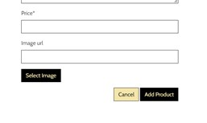

#### Links
* All Navbar and footer links work correctly, some navigate within the site and some external.

### Workshops and Candle Products
* Users can navigate to view all workshops or candles via the respective links from the nav menu,
and this will take the user to the Workshop or Candles list page. 
* On each page the number of products is displayed, as well as a sort menu so they can be sorted by name or price. 

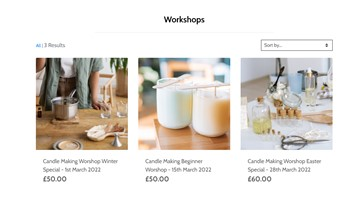

*   Users can view Individual Workshop/Candles details to fine prices, descriptions, the associated image, dates and timings, quantity they would like to add to basket and a add to basket button.

* Registered Users can review and products, as well as edit, delete or add a new review through a review modal. 

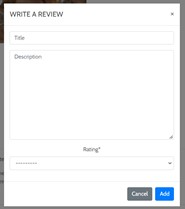

### Registration and User Accounts
*   Users can easily register or login for an account from the dropdown menu of the My Account icon in the navbar. 

*   A new user can register and create a profile to prefill a form for shipping and billing details needed for purchases. 

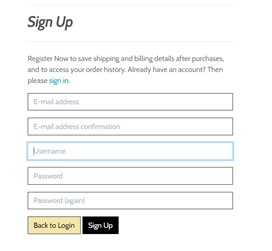

* a newly registered user is prompted to verify their email address and once this is done, they can redirect to the sign in page.
* A message will pop up stating that the user has successfully signed in.

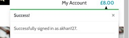 

*    Users can easily login or logout to access their personal account information and order history which will appear under their profile page.

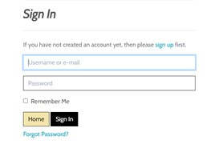

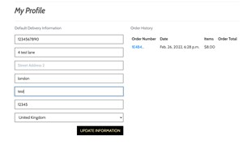

 * If a returning user make any mistakes while logging in an error message is displayed to let the user know that they can try again. 

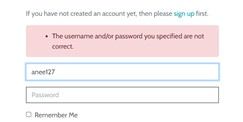     

 *   Users can easily recover their password in case they forget to gain access to their account again, located under the login page details.
 
### Searching
*    Through the search bar users can look for both workshops and candles based on keywords found in the names of each product based on the search criteria.  A list off all results can appear if applicable.

### Basket and Checkout
*   Any user can add a workshop/candle product to their basket and select the quantity. A message will pop up showing that it has been added to the basket.

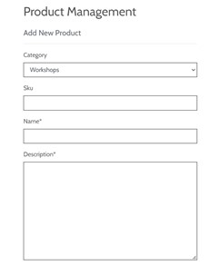

* The user can view the full basket by navigating to the basket icon in the navbar.
* Each item is displayed in the basket along with the individual prices, quantity and subtotal. 

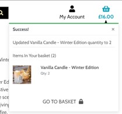

* Grand total of the items, including delivery charges (if any) is also displayed to display all prices and calculations.
* Users can modify the quantity of each item added to the basket by updating or even remove the whole item by clicking the bin icon and the basket total will be adjusted automatically. 

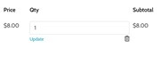 

*   Users can checkout the items by filling in shipping, billing and credit card details.

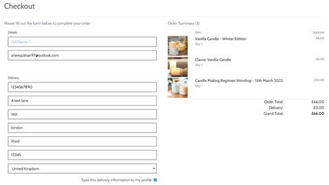

* The user is sufficiently notified if the card number is invalid, validated by Stripe. 

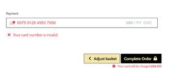

*  A successful purchase message is displayed once the purchase has been made correctly and an order number is generated.

)

#### Blog Function and Management
*	A blog list is displayed correctly one under the other displaying the blog title, author and date of post as well as a link to go to the blog detail.

 

*	In the blog details page comments can be made by any user but cannot be edited or deleted by user. 

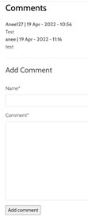 

*	CRUD functionality is applied to the blog post for site admin to add, delete or edit a post. 

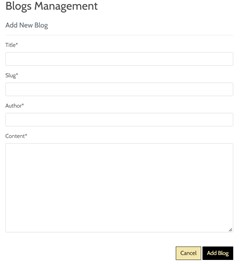 

#### Admin product management
* The admin/owner can make changes to products through CRUD operations within the website rather than through Django admin, in case the shop owner does not have access.
*   A product and blog management option is displayed through the account dropdown menu. 

* A new workshop/product can be created through a form by adding a Title, Category, Description, Image URL and Price, which will then be added to the database, the system also checks that the mandatory fields are filled.

* Existing workshops/products can be edited or deleted directly through the website, only available to the admin/owner.

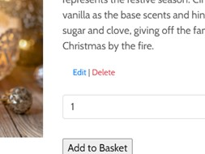

*   a message will appear once the workshop/product has been created / Edited / Deleted successfully.

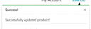

## Automated Testing

### Validation Tests

* **HTML Validation**
-   The HTML for the project has been validated using [W3C's Validation service](https://validator.w3.org/). 
-   The generated html is complaint as per W3C standards with one error stating that duplicate IDs are being used, however this does not need to be changed as one is a label.

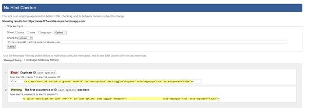

* **CSS Validation**
-   The CSS for the project has been validated using [W3C's CSS Validator](https://jigsaw.w3.org/css-validator/). 
-   The results came back with no errors. 

 

* **JavaScript Validation**
The custom JavaScript code has been validated using [JShint](https://jshint.com/). The only warning was due to the use of $ which has been used for jQuery references and cannot be changed.

* **PEP8 Compliance**
The python code file has been tested for PEP8 compliance, using the [PEP8 online]( http://pep8online.com/). Changes had to be made manually as GitPod does not have a python code formatter or checker that can be installed. Most issues have been fixed but some warnings do not affect the overall code, so these were left along, for example when a line is too long.

* **Performance Testing**
-   Lighthouse Summary

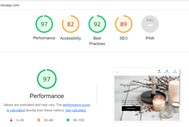

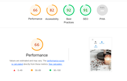

**Test for 404 - File not found**

As per the internal built in 404 error message display of Django Framework with Debug set to False in code

**Test for 500 - Internal Server Error**

As per the internal built in 500 error message display of Django Framework with Debug set to False in code

#### Bugs
-   There was one major bug that I was not able to fix. The email confirmation of purchases would not be sent out to users causing a webhook failure. I would like to get this fixed once I have more time to spend on the project. I spent hours with a course tutor to try to figure out the source of the problem, to no avail. 
--------------------------------------------------------------------------------------------------------------------------------------------------------------------------

[BACK TO README FILE]( https://github.com/anee127/Milestone-Project-4/blob/main/README.md)
